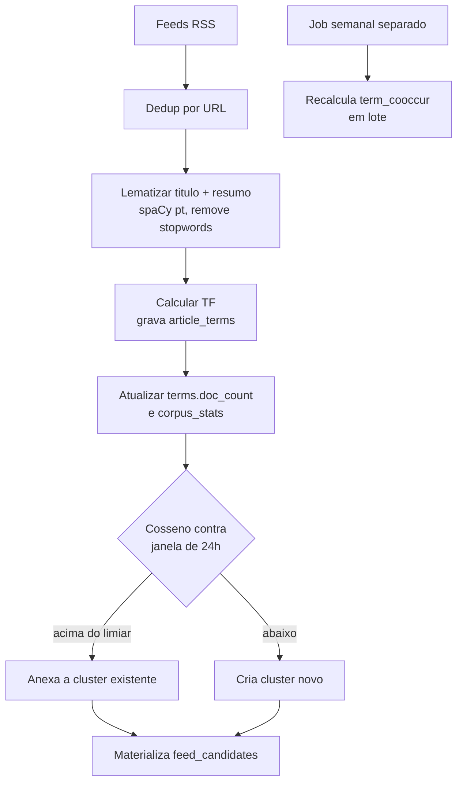
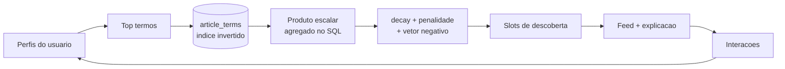

# Notle: arquitetura e decisões

Agregador de notícias com feed personalizado e explicável. Consome RSS de portais brasileiros, agrupa matérias sobre o mesmo fato, e monta um feed rankeado por gosto usando TF-IDF e similaridade de cosseno, sem nenhuma API paga.

O objetivo declarado do projeto é que **toda posição no feed seja explicável**. Se o sistema não consegue dizer por que uma notícia subiu, o sistema está errado, mesmo que o resultado pareça bom.

## Sumário

- [Restrições que moldaram o desenho](#restrições-que-moldaram-o-desenho)
- [Stack e hospedagem](#stack-e-hospedagem)
- [Modelo de dados](#modelo-de-dados)
- [Pipeline de ingestão](#pipeline-de-ingestão)
- [Sinais de interação](#sinais-de-interação)
- [Os quatro vetores de perfil](#os-quatro-vetores-de-perfil)
- [Fórmula de ranking](#fórmula-de-ranking)
- [Explicabilidade](#explicabilidade)
- [Descoberta e controle da bolha](#descoberta-e-controle-da-bolha)
- [Cold start](#cold-start)
- [Avaliação e calibragem](#avaliação-e-calibragem)
- [Decisões técnicas](#decisões-técnicas)
- [Roadmap por fatias](#roadmap-por-fatias)

## Restrições que moldaram o desenho

Três restrições explicam quase toda decisão daqui pra frente:

1. **Demo público ao vivo.** Qualquer pessoa abre a URL e usa. Não é um repositório pra clonar.
2. **Custo zero de operação.** Sem servidor sempre ligado, sem API paga, sem banco pago.
3. **Usuário anônimo por navegador.** Sem login, sem senha, sem segredo. Cada visitante é um usuário novo.

A terceira tem uma consequência que reorganiza o projeto inteiro: **todo visitante é um cold start**. O onboarding não é caso de borda, é o caminho principal, e é a única tela que a maioria das pessoas vai ver.

## Stack e hospedagem

| Peça | Escolha | Por quê |
|---|---|---|
| API | FastAPI como função serverless | Cold start de ~1s em vez dos ~50s de um contêiner de plano gratuito que hiberna |
| Banco | SQLite gerenciado na borda (Turso / libSQL) | Não hiberna, e fala HTTP em vez de protocolo de conexão, o que elimina o esgotamento de conexões que é a forma clássica de um app serverless com Postgres cair sob carga |
| Ingestão | GitHub Actions agendado | Ler RSS é um job de 30 segundos por hora. Não justifica um worker sempre ligado, e worker sempre ligado é justamente o que ninguém dá de graça |
| Front | React + Vite, estático, com service worker | Offline do último feed é a única capacidade que faz o rótulo PWA significar algo num leitor de notícias |

O serverless impõe uma fronteira que vale como regra do projeto:

> **Nada pesado acontece dentro de um request.** Tokenização, lematização, cálculo de IDF, clusterização e co-ocorrência vivem no job de ingestão. O request só lê índice e soma.

Efeito colateral bom: como a API nunca tokeniza nada, o modelo de linguagem pesado (spaCy) roda só no GitHub Actions, onde tempo de execução e tamanho de dependência não custam nada.

## Modelo de dados

```
sources          id, name, feed_url, homepage_url, active, created_at

clusters         id, representative_article_id, first_seen_at, size

articles         id, source_id FK, cluster_id FK, title, summary,
                 url UNIQUE, published_at, fetched_at

terms            term PK, doc_count
corpus_stats     total_docs

article_terms    article_id FK, term, tf        -- PK (article_id, term), índice em term
term_cooccur     term_a, term_b, score          -- índice em term_a

users            id, created_at, discovery_ratio

interactions     id, user_id FK, article_id FK, cluster_id, session_id,
                 type, value, duration_ms, created_at

user_profile     user_id PK, term_vector JSON, neg_term_vector JSON, updated_at

feed_candidates  run_id, cluster_id, base_score, top_terms JSON   -- materializada pelo cron
```

Três pontos que não são óbvios:

**`article_terms` guarda TF cru, nunca TF-IDF.** IDF é função do corpus inteiro e muda a cada ingestão. Se eu materializasse TF-IDF, um artigo de janeiro carregaria um IDF calculado sobre mil documentos e um de julho sobre cinquenta mil, e eu estaria comparando por cosseno dois vetores medidos em réguas diferentes. O artigo velho ganharia um bônus sistemático que não tem nada a ver com gosto, e a explicação na tela ("subiu porque você curte tarifa") seria mentira. Guardando TF e aplicando `log(total_docs / doc_count)` na hora do ranking, o IDF está sempre atual e nenhum backfill é necessário.

**Não existe tabela de perfil de sessão.** O vetor de sessão é recalculado a partir de `interactions` filtrando por `session_id`. São poucas linhas, e recomputar é sempre correto.

**`articles` não é podada, `article_terms` é.** Título e resumo custam uns 55MB por ano. O volume está nos termos, então só eles são removidos além da janela de ranking. Assim o histórico de interações continua auditável sem estourar o armazenamento do plano gratuito.

## Pipeline de ingestão



**Lematização, não stemming.** Português é muito flexionado: sem tratamento, `eleição` e `eleições` viram termos distintos que nunca se encontram, cada um com metade da massa e IDF inflado. Stemmer agressivo resolve o casamento mas produz `eleic`, e como a tela precisa exibir o termo pro usuário, isso quebraria a explicabilidade que é o motivo do projeto existir. O lema já é palavra real, então serve de chave interna e de texto de tela sem tabela de tradução.

**Clusterização resolve o problema que `url UNIQUE` não resolve.** A restrição de unicidade só evita reler a mesma URL. O problema de verdade é que G1, BBC e CNN publicam a mesma matéria com URLs diferentes:

> "Copom mantém Selic em 10,5% ao ano" / "Banco Central decide manter taxa Selic em 10,5%" / "Selic: Copom mantém juros em 10,5%"

Sem agrupamento, os três ocupam o topo do feed com pontuação empatada, e a primeira impressão do demo é de sistema quebrado. Pior: se o usuário curte um, o perfil reforça aqueles termos e os outros dois sobem mais ainda. O feed rankeia clusters e mostra "também em BBC e CNN".

**O cluster tem âncora fixa, não centroide.** O vetor comparado é o do artigo que abriu o grupo, escrito uma vez e nunca reescrito. Um centroide aguentaria melhor uma primeira matéria magra, mas deriva: num evento com vinte matérias em 24 horas o centro vai ficando genérico e a fronteira vai relaxando até cobertura vizinha cair dentro. Com âncora fixa, todo candidato precisa parecer com a matéria original, e a explicação cabe numa linha, "cosseno 0.71 contra a matéria que abriu o grupo". `clusters.representative_article_id` é onde ela mora, e o mesmo campo decide qual título o card mostra.

**A comparação é sobre vetores ponderados por IDF, não sobre TF cru.** Em TF cru, duas matérias que só dividem `presidente`, `governo` e `país` parecem a mesma história, e esses são justamente os termos de maior `doc_count`. Dedup precisa dos termos que discriminam. As contagens são lidas uma vez no começo da passada, antes do próprio run somar as suas, para que a ordem em que os feeds responderam não mude quem agrupa com quem.

### Como o limiar foi escolhido

`limiar_cluster = 0.30`, medido contra os 311 artigos que o corpus tinha em 31/07/2026, seis portais numa janela de 24 horas, rodando o algoritmo em todo limiar de 0.20 a 0.45 e lendo grupo por grupo o que cada um produziu.

| limiar | clusters | multi-artigo | artigos agrupados |
|---|---|---|---|
| 0.27 | 266 | 20 | 65 |
| **0.28 a 0.30** | **269** | **17** | **59** |
| 0.31 | 270 | 17 | 58 |
| 0.37 a 0.40 | 277 | 12 | 46 |

O resultado é plano em `[0.28, 0.30]`: 17 grupos, 11 deles cruzando portais, e nenhuma fusão errada entre eles. São as bordas que fixam o valor dentro dessa faixa, não o meio:

- Em **0.27** entra o primeiro falso positivo. "Unidade Popular oficializa candidaturas ao governo e Senado no Pará" cola em "PCdoB oficializa apoio à candidatura de Lula" com cosseno 0.272, porque dividem `oficializar`, `candidatura` e `partido`. São eventos diferentes.
- Em **0.31** começa a perder duplicata real: Santander em 0.337, os imigrantes em Ceuta em 0.310, o fio da Fifa em 0.301.

0.30 fica com folga dos dois lados em vez de na beira. É medida, não intuição, e vale ser medida de novo quando o corpus for grande o bastante para o IDF ter se mexido.

**Confirmado contra um segundo lote, com o erro que ele revelou.** Um lote posterior de 247 artigos novos, de outra hora do dia e com muito mais cobertura policial regional, anexou 38 deles a clusters existentes e produziu duas fusões erradas que o primeiro conjunto não tinha. As duas são do mesmo tipo: notícia de polícia de cidades diferentes, que divide vocabulário pesado (`polícia`, `operação`, `preso`, `suspeito`) sem falar do mesmo fato.

| limiar | anexam a cluster existente | pares suspeitos ainda juntos |
|---|---|---|
| **0.30** | **38** | 2 |
| 0.33 | 25 | 2 |
| 0.35 | 22 | 2 |
| 0.38 | 17 | 0 |

Os dois erros só se separam em 0.38, e chegar lá custa mais da metade das anexações corretas. Trocar 21 fusões certas por 2 erradas é o pior lado do negócio, então 0.30 fica. O que isso diz é que o erro mora na cauda e não na escolha do valor, e que a saída, se incomodar, não é mexer no limiar: é o simulador de personas da fatia 8, ou um sinal que o cosseno não vê, como localidade.

Duas coisas que os dados reais mostraram e o desenho no papel não previa:

**As duplicatas entre portais são bem menos parecidas do que a intuição sugere.** Elas vão de 0.667 ("Trump anuncia conclusão de acordo para desarmamento do Hamas" contra a versão da BBC) até 0.253, e a mediana fica perto de 0.35. Um limiar escolhido no olho, algo como 0.6 ou 0.7, capturaria menos de um terço delas.

**O topo absoluto da distribuição não é duplicata, é template.** Os 21 pares mais parecidos do corpus, todos entre 0.79 e 0.88, são a previsão do tempo do G1 publicada uma vez por cidade. São 21 dos 311 artigos, 6,7% do corpus, e agrupam num cluster só em qualquer limiar de 0.20 a 0.45. Isso é acerto: sem agrupar, o feed mostra 21 cards de previsão do tempo, que é literalmente a repetição que esta fatia existe pra remover. A consequência é no card, não no algoritmo: "também em BBC e CNN" não serve pra um grupo de um portal só, então a linha lista as fontes distintas e, quando há uma só, mostra a contagem.

Um efeito colateral apareceu no caminho e virou correção à parte: manchete brasileira separa assunto de afirmação com dois pontos, e o reconhecimento de entidade lia através deles. "Selic: Copom mantém os juros" voltava como uma entidade só e virava o termo `selic: copom`, que nenhum outro artigo pode compartilhar. Nas três manchetes de exemplo acima, isso sozinho movia o cosseno de 0.29 pra 0.75, de um lado do limiar pro outro. O span agora é quebrado na pontuação antes de fundir, e um nome que esteja depois dos dois pontos continua fundindo sozinho.

## Sinais de interação

O sistema mede quatro etapas de um funil, e cada uma filtra a anterior:

| Etapa | O que é medido | Peso | Destino |
|---|---|---|---|
| impressão | card entrou na viewport | 0 | só anti repetição |
| dwell | segundos no card, normalizado | baixo | positivo |
| click | saiu pro portal | 0.4 | positivo |
| retorno < 15s | voltou quase na hora | anula o click | negativo fraco |
| retorno > 60s | ficou lendo | +0.6, satura | positivo |
| retorno > 5min | descartado | 0 | nenhum |
| like | explícito | 1.0 | positivo |
| save | explícito | 1.2 | positivo |
| share | explícito | 1.5 | positivo |
| hide | explícito | 1.0 | negativo |

Três regras que vieram de furos encontrados no desenho original:

**Impressão nunca alimenta o perfil.** Se alimentasse, o laço fecharia: o ranking mostra o que o usuário já gosta, a exibição confirma que ele gosta, o perfil aperta, o ranking mostra mais do mesmo. Impressão não é preferência, é consequência do próprio ranking. Ela serve só pra evitar repetir o mesmo topo de feed, com penalidade crescente e sumiço após três exibições. Notícia boa não desaparece por ter passado na tela.

**Dwell é normalizado pelo tamanho do resumo.** Sem isso o sistema não mede interesse, mede comprimento de texto: se a CNN publica resumos de 40 palavras e a BBC de 15, o leitor gasta mais segundos nos cards da CNN, o peso sobe, e em duas semanas o algoritmo "aprendeu" uma preferência de fonte que não existe. É um viés invisível, porque as métricas de engajamento sobem enquanto ele se instala.

**Tempo fora é assimétrico, e só a metade confiável é usada.** Um retorno em 5 segundos só tem uma explicação plausível, que é rejeição. Um retorno em 4 minutos tem dez explicações, e a mais provável nem é leitura: pode ser mensagem respondida, telefone no bolso, almoço. Por isso o retorno curto vale como sinal negativo, o retorno longo satura cedo em um valor pequeno, e acima de 5 minutos o evento é descartado como ausência de informação em vez de virar chute. No celular a confiabilidade é ainda menor, porque sair de um PWA pode suspender ou matar a aba.

**O feed não devolve o que já foi respondido.** Esconder é a metade óbvia. A outra metade apareceu ao implementar: o perfil é construído a partir dos termos dos clusters curtidos, então o cluster curtido casa consigo mesmo melhor do que qualquer outra coisa pode casar. Medido, ele voltava ao topo com cosseno 0.213 num feed onde o segundo colocado tinha 0.023, quase dez vezes menos, e ficaria ali. Isso não é uma preferência que o leitor expressou, é o vetor se reconhecendo. É o mesmo laço da impressão visto de outro ângulo: o sistema mede a própria escolha e chama de gosto.

Só sinal explícito entra nessa exclusão. Impressão, que chega na fatia 5, mede o que o ranking resolveu mostrar e não o que o leitor achou, e usá-la aqui esconderia matéria pelo crime de ter aparecido.

Daí a regra geral:

> **Sinal implícito ajusta, sinal explícito decide.** Nenhum sinal implícito sozinho pode reordenar duas notícias que têm sinal explícito diferente.

Sistemas grandes toleram ruído implícito porque o erro se cancela na média de milhões de eventos. Este não vai ter volume, então peso baixo em sinal implícito não é timidez, é a única postura defensável nesta escala.

## Os quatro vetores de perfil

| Vetor | Constante de tempo | Origem | Onde mora |
|---|---|---|---|
| longo | meses | eventos positivos ponderados | `user_profile.term_vector` |
| sessão | ~10 min de meia-vida | mesmos eventos, outra leitura | recomputado por `session_id` |
| negativo | meses | eventos de `hide` | `user_profile.neg_term_vector` |
| expandido | estático por corpus | co-ocorrência de termos | `term_cooccur` |

**Positivo e negativo são separados, não somados.** No desenho original o `hide` entrava como componente negativa num vetor único, e isso quebrava o decay: com `score * decay`, dois artigos indesejados de cosseno `-0.5` produzem `-0.485` (1 hora de idade) e `-0.063` (72 horas), ou seja, o ranking prefere o mais velho entre duas coisas que o usuário não quer. E um artigo de assunto totalmente desconhecido, com cosseno exatamente zero, flutua acima dos dois. Eram três regimes de ordenação que não conversavam. Com dois vetores, os dois cossenos ficam em `[0,1]`, o decay só multiplica coisa positiva, e a inversão some.

O ganho maior é de explicabilidade: dá pra dizer "subiu porque você curte X" **e** "desceu porque você escondeu Y", que é uma explicação que quase nenhum agregador oferece.

**O vetor de sessão é o mesmo log lido com outra constante de tempo.** Não há evento novo: a contribuição de cada interação decai exponencialmente com o tempo desde que ela ocorreu, com meia-vida de uns 10 minutos. Três interações com economia em 90 segundos empilham três contribuições quase inteiras; as mesmas três espalhadas por uma hora chegam quase zeradas. A velocidade de consumo em sequência cai de graça na matemática, sem nenhum código que calcule taxa.

Duas travas obrigatórias nele:

- **Morre com a sessão.** Se vazasse pro perfil longo, uma tarde curiosa sobre futebol viraria identidade permanente.
- **Peso adaptativo com teto de 0.35.** `w_sessao` cresce com a concentração do vetor de sessão e para no teto. Navegação dispersa zera o peso sozinha; maratona num tema liga ele. Sem teto, três toques em esportes convertem o resto da sessão inteira em esportes, porque o próprio reforço gera mais engajamento que aumenta o reforço. É o mesmo laço vicioso da impressão, rodando em minutos em vez de semanas.

**Expansão por co-ocorrência substitui filtragem colaborativa.** Filtragem colaborativa está estruturalmente bloqueada aqui por dois motivos independentes. Primeiro, usuários anônimos num demo de portfólio significam uma população de dezenas de pessoas e uma matriz usuário/item com mais de 99% de células vazias, o que produz coincidência e não recomendação. Segundo, e isso valeria mesmo com um milhão de usuários: **notícia morre em 48 horas**, e colaborativa item-item precisa acumular co-ocorrência ao longo do tempo. Quando o acúmulo termina, o artigo já é lixo histórico. É por isso que sistema de notícia de verdade não faz colaborativa no nível da matéria.

A substituição usa o próprio corpus como população: se `selic` co-ocorre com `câmbio` e `inflação` em milhares de artigos, o perfil expande pra vizinhos que o usuário nunca tocou. Entrega o efeito de descoberta de interesse adjacente, continua explicável ("quem acompanha Selic costuma acompanhar câmbio"), e não depende de multidão nenhuma. **Não é filtragem colaborativa, e o texto não a chama assim.**

A co-ocorrência é recalculada em lote uma vez por semana, gravando só os vizinhos mais fortes de cada termo, e não atualizada par a par durante a ingestão. Atualizar incrementalmente custaria cerca de 300 pares por artigo, o que em 300 artigos diários daria 90 mil escritas por dia para uma estatística que se move devagar. O lote semanal derruba isso em mais de uma ordem de grandeza sem perda de qualidade perceptível.

## Fórmula de ranking

```
score = ( w_longo  * cos(perfil_longo,     item)
        + w_sessao * cos(perfil_sessao,    item)     # adaptativo, teto 0.35
        + w_coocor * cos(perfil_expandido, item) ) * decay(idade)
        - beta * cos(perfil_negativo, item)
        - penalidade_de_impressao
```

### O piso de recência, e o que ele significa

Enquanto o onboarding não existe, todo visitante chega com perfil vazio, todo cosseno é exatamente zero e todos os candidatos empatam. A tela que decide se a pessoa fica seria ordenada por nada. Por isso a forma em produção soma um piso **dentro** do decay:

```
score = (W_GOSTO * cos(perfil, cluster) + W_RECENCIA) * decay(idade)
```

Com perfil vazio sobra `W_RECENCIA * decay`, que ordena por recência, e o cold start não precisa de nenhum ramo no código: é a mesma expressão com um termo zerado. Piso fora do decay viraria constante somada a todos, não ordenaria nada, e o empate voltaria.

Só a razão entre as duas constantes importa, e ela tem uma leitura única. Como o decay multiplica a soma inteira, piso incluído, uma matéria com afinidade `c` ganha de outra sem afinidade e uma meia-vida mais nova exatamente quando `c > W_RECENCIA / W_GOSTO`. Ou seja:

> **`W_RECENCIA` é o cosseno que vale uma meia-vida de idade.**

O que torna a constante mensurável em vez de questão de gosto. Medindo 20 perfis montados como um like monta, a média dos vetores dos clusters que o leitor guardou, contra os 1576 candidatos da janela ao vivo, o que dá 11604 pares com alguma sobreposição:

| | cosseno perfil/candidato |
|---|---|
| máximo | 0.381 |
| p99 | 0.116 |
| p95 | 0.065 |
| **p90** | **0.044** |
| mediana | 0.011 |

Fica abaixo dos 0.25 a 0.67 que duas matérias sobre o mesmo fato marcam entre si, e por um motivo simples: um perfil de poucos termos está sendo comparado com um vetor de manchete de uns 26, então a sobreposição é fina mesmo quando o assunto é o certo.

> **Correção.** A tabela acima registrava máximo 0.155, p99 0.069, p95 0.042, p90 0.028 e mediana 0.001, e esses números estavam errados. Não por causa de um corpus menor: **o produto escalar estava sendo montado errado**. `contributions()` multiplicava o `tf` cru do candidato pelo termo já ponderado do perfil, e dividia por `feed_candidates.norm`, que é o comprimento do vetor *com* IDF. Faltava um IDF do lado do candidato.
>
> O erro não era um fator de escala que cancela. Medido contra a janela ao vivo ele ia de **3.1× a 7.2×** conforme os termos que casavam, o que comprimia todos os candidatos numa faixa de 0.017 a 0.021 e deixava "IFMG abre vagas para cursos técnicos" passar na frente de "Corinthians: Diniz denunciado no STJD" contra um perfil de futebol. A explicabilidade do card herdava a distorção, porque os termos de "porque você acompanha" saem ordenados por contribuição.
>
> Com a conta corrigida, os valores da tabela são os medidos sobre 20 perfis contra os 1576 candidatos da janela, 11604 pares com alguma sobreposição.

`W_RECENCIA = 0.04` põe a barra logo abaixo do p90 de 0.044, então um candidato no décimo superior de afinidade vale doze horas de idade e o resto é ordenado por frescor. O valor anterior era 0.025, escolhido pela mesma regra contra a distribuição errada. **O primeiro valor tentado foi 0.10**, escolhido por analogia com os cossenos entre artigos, e ele estava acima do p99: nada que o leitor curtiu conseguia superar uma matéria nova sobre coisa nenhuma. O perfil virava decoração e o feed, um relógio. A constante continua provisória e continua sendo trabalho da fatia 8, mas agora é medida com significado declarado em vez de número escolhido no olho.

### O peso do vetor negativo, e o piso que ele precisou

O `hide` entra como `- BETA * cos(perfil_negativo, item)`, fora do decay. Fora, e não dentro, porque dentro dele uma matéria rejeitada seria perdoada por envelhecer, e dois dias depois o feed voltaria justamente ao assunto que o leitor mandou sair.

**O primeiro valor tentado foi `BETA = 1.0`**, pela simetria com `W_GOSTO`: os dois lados são cossenos medidos do mesmo jeito, e `like` e `hide` pesam igual no log. O argumento estava certo sobre os dois cossenos e errado sobre o score de onde um deles é subtraído. Uma matéria intocada deste momento marca `W_RECENCIA`, então uma penalidade de 0.005 por partilhar a palavra `experiência` já punha o card abaixo de tudo que era fresco: um único `hide` alcançou 294 dos 1576 candidatos e jogou todos abaixo de zero.

Medido escondendo um cluster só, "Diego Souza é anunciado como novo técnico do Joinville", contra a janela ao vivo de 1576 candidatos: ele alcançou **294 deles**, e a ordenação desses 294 não era uma ordenação de futebol.

| cosseno | matéria | o que casou |
|---|---|---|
| 0.139 | Pentacampeão passa por cateterismo | o assunto |
| 0.122 | Corinthians: Diniz denunciado no STJD | o assunto |
| 0.119 | Vasco x Fluminense | o assunto |
| | *piso* | |
| 0.080 | IFMG abre vagas para cursos técnicos | `técnico` |
| 0.063 | Endrick no Real Madrid | o assunto |
| 0.056 | C6 condenado, aposentado lesado | `aposentar` |
| 0.055 | Xuxa anuncia terceiro show | `experiência` |

O que fica logo abaixo de 0.10 é **polissemia**, a fraqueza permanente de um saco de lemas: `técnico` é treinador e é curso técnico, `aposentar` é sair do futebol e é puxar aposentadoria. Um modelo sem sintaxe não separa os dois, então a saída honesta é recusar evidência tão fina em vez de fingir que o número diz o que não diz. Daí `NEGATIVE_FLOOR = 0.10`, que deixa passar 3 dos 1576. Cobertura real de um mesmo fato marca 0.25 a 0.67, bem acima disso, então nada que o leitor reconheceria como o assunto escondido é barrado.

Esse piso sobreviveu à correção do produto escalar, porque a tabela acima foi medida como cosseno verdadeiro desde o começo, por fora do código. Quem discordava dela era o ranking, não a medição.

E `BETA = 0.1`, com a mesma leitura verificável que `W_RECENCIA` tem:

> **`BETA` fixa quanto custa a semelhança mais forte medida, e em 0.1 isso é cerca de uma meia-vida de frescor.**

O máximo observado é 0.381, então o pior caso custa 0.038 contra um piso de 0.04. Acima do `NEGATIVE_FLOOR` a penalidade vai de 0.010 a 0.038: rebaixamento real, e nunca mais do que o piso inteiro vale. O teto importa por um motivo específico: **se o score passasse a negativo, o decay inverteria**, porque multiplicar um negativo por um número menor o aumenta, e a mais velha de duas matérias indesejadas subiria acima da mais nova. É a mesma inversão que os dois vetores separados existem para evitar.

### Onde a direção negativa se explica

Um `hide` faz duas coisas: tira aquele cluster, e rebaixa tudo que se parece com ele. O leitor enxerga a primeira e não a segunda, e a razão é aritmética. A pior penalidade custa 0.038, e o intervalo inteiro de score dentro de uma página de 24 cards é menor que isso. Num acervo de 1576 candidatos ordenado por recência, **qualquer card que passe do piso negativo cai para fora da página, e lá não tem onde se explicar**.

Isso não se resolve calibrando `BETA`: uma penalidade pequena o bastante para o card ficar na página é pequena demais para significar alguma coisa.

Houve uma tentativa de resolver dentro do próprio feed, um bloco `held_back` listando as matérias que a penalidade empurrou para fora. Ela foi **descartada por decisão de produto**: um leitor que pediu para não ver um assunto não quer uma seção dedicada a mostrá-lo de volta, por mais bem explicada que ela seja. A prestação de contas passou a ser a página de **Últimas**, que mostra tudo em ordem cronológica e traz um interruptor para incluir o que foi ocultado. Ali o leitor confere o que a instrução dele está custando, no momento em que ele escolhe conferir, em vez de a cada rolagem do feed.

A explicação positiva continua em todo card. A negativa continua no card quando cabe, que é quando o gosto segura a matéria na página apesar da penalidade.

O produto escalar acontece **no banco**, não em Python. Com os vetores serializados num campo JSON, montar um feed exigiria trazer milhares de blobs pra memória do processo e parsear todos, o que é da ordem de centenas de milissegundos e alguns megabytes por request, num ambiente serverless onde tempo de execução é o que se paga, e que cresce linearmente até quebrar.

Com `article_terms` indexada por `term`, a consulta manda os termos mais fortes do perfil e o banco toca só os artigos que compartilham algum deles. O trabalho passa a ser proporcional à sobreposição e não ao acervo. É indexação invertida clássica.

E há um subproduto que resolve outro requisito de graça: **a agregação por termo já vem quebrada por termo**, então os três termos que mais contribuíram para o score saem da mesma consulta, em vez de exigirem um cálculo separado.



## Explicabilidade

Cada card carrega a razão de estar naquela posição, nas duas direções:

- "recomendado porque você acompanha: **juros**, **Copom**, **inflação**"
- "menos relevante porque você escondeu: **futebol**"
- "**descoberta**: você nunca leu sobre isso"
- "você está numa sequência sobre **Selic** agora"

Os termos vêm da própria consulta de ranking, não de um cálculo paralelo, então a explicação é literalmente a razão aritmética da posição e não uma racionalização produzida depois.

## Descoberta e controle da bolha

Todos os mecanismos acima reforçam: o perfil longo reforça o que foi tocado, o de sessão reforça o que acabou de ser tocado, a co-ocorrência expande só pra vizinhos, o negativo só remove, e o decay só mexe em idade. Nenhum introduz algo genuinamente novo.

A consequência é matemática, não filosófica: **um tema nunca tocado tem cosseno perto de zero, logo nunca sobe, logo nunca é exibido, logo nunca pode ser curtido, logo nunca entra no perfil.** É um estado absorvente. Depois de umas 20 interações o perfil converge e o feed vira um espelho que só fica mais nítido.

Isso não é defeito de implementação, é o comportamento correto de um recomendador baseado puramente em similaridade. E tem nome na literatura: **zemblanity**, termo de William Boyd que Santini traz como o oposto de serendipite, definido como "fazer encontros previsíveis e sem valor, que ocorrem a partir de uma modelagem" (SANTINI, 2020, p. 109). Um recomendador que converge é uma máquina de zemblanity.

Por isso o estado absorvente é tratado explicitamente:

- **Slots de descoberta.** Uma fração dos slots é reservada a itens de alta qualidade e baixa afinidade, marcados com selo próprio no card.
- **Controle do usuário.** A fração é um slider, de bolha até descoberta, guardado em `users.discovery_ratio`.
- **Entropia visível.** A entropia do `term_vector` é uma medida direta de concentração de gosto, e é exibida como diagnóstico: "seu feed está concentrado em 3 temas".

## Desempenho, cache e percepção de carregamento

O ponto de partida é que **o dado já nasce velho de propósito**: a ingestão roda de hora em hora, então nada no corpus muda entre duas execuções do cron. Cachear agressivamente não introduz incorreção nenhuma, só devolve o que já era verdade.

**Camada 1, tabela materializada.** O job grava `feed_candidates` com os clusters da janela, já com termos ponderados por IDF e um score base de recência. O request deixa de recalcular IDF e passa a cruzar o candidato com o perfil e ordenar. É a única camada de cache que não exige serviço novo, credencial nova nem custo, o que a torna a primeira a existir.

**Camada 2, HTTP.** Assets com nome versionado e cache imutável. O feed responde `Cache-Control: private`, porque é personalizado e não pode ser compartilhado em cache intermediário. Um endpoint único monta usuário, perfil e feed numa chamada, em vez de encadear três e criar cascata de espera.

**Camada 3, service worker.** Estratégia de servir o cache e revalidar em segundo plano. É de longe o maior ganho de percepção: quem volta vê conteúdo real de imediato, e a latência do banco acontece invisível atrás da tela já preenchida.

**Skeleton loading**, com duas regras que não são detalhe:

- Só aparece depois de um limiar de uns 200ms. Abaixo disso ele pisca e a tela fica pior do que se nada existisse.
- **Card de skeleton nunca dispara impressão.** Se disparasse, o sistema registraria visualização de notícia que ninguém viu e envenenaria a penalidade de repetição com fantasma.

**Não há balanceador de carga, e isso é deliberado.** Balanceador é o que se coloca na frente de servidores administrados por você. A API é serverless, e a plataforma já distribui entre instâncias. O risco real de queda sob carga num app serverless não é distribuição de request, é **esgotamento de conexão com o banco**, e ele desaparece por construção com libSQL, que fala HTTP e não mantém conexão persistente. O componente ausente resolve um problema que a arquitetura não tem.

**Consequência da métrica do Turso.** O plano cobra por linha varrida, incluindo as descartadas pelo `WHERE`. Isso torna o índice em `article_terms(term, ...)` obrigatório e recomenda recorte de janela dentro da própria consulta, para que o acervo antigo nunca seja tocado por um feed que só olha as últimas semanas.

## As três superfícies

O feed personalizado responde "o que eu leio". Sozinho ele é um recomendador sem escapatória: se o leitor discorda do ranking, não tem para onde ir. As outras duas existem para dar essa saída, e nenhuma delas consulta perfil.

| Rota | Ordem | Perfil | Escreve |
|---|---|---|---|
| `/` | score, ou seja gosto e recência | lê os dois vetores | like e hide |
| `/ultimas` | cronológica pura | só para omitir o que foi ocultado, e há interruptor | like e hide |
| `/buscar` | `bm25` sobre o texto | nenhum | like e hide, salvo em modo anônimo |

**Últimas não lê de `feed_candidates`.** Aquela tabela é a janela de ranking de 48 horas, e uma lista feita para ser rolada tem que continuar depois de onde o feed deixa de se interessar. Ela ordena por `clusters.first_seen_at`, que é a publicação da matéria que abriu o grupo e tem índice próprio.

**Busca usa FTS5, não `LIKE` nem o índice de lemas.** Os três foram considerados e dois caíram por motivos diferentes. `LIKE` varre o acervo inteiro a cada consulta, que é exatamente o padrão que o custo por linha varrida do D1 pune e que motivou o índice invertido em primeiro lugar. O índice de lemas seria de graça, mas casar a busca contra lemas exige lematizar o que foi digitado, e spaCy não roda dentro do Worker. FTS5 com `remove_diacritics 2` resolve os dois: é indexada, e dobra o acento dos dois lados, então `eleicao` acha `eleição` sem a consulta passar por modelo nenhum.

Uma sutileza que custou uma sessão de depuração: `bm25()` só funciona enquanto o cursor que casou está aberto, e agrupar por cluster sobre uma subquery comum deixa o SQLite achatar as duas, depois do que a mesma consulta falha com *unable to use function bm25 in the requested context*. O `AS MATERIALIZED` no CTE não é dica de desempenho, é o que mantém a função onde ela consegue responder.

**Busca anônima promete só o que é verdade.** Hoje a única coisa que altera o perfil é like e hide, então o modo anônimo tira os botões e nada é escrito. A promessa é exatamente essa na tela, sem sugerir privacidade maior do que existe. Quando a fatia 5 trouxer impressão, dwell e tempo fora, o mesmo interruptor já cobre esses sinais, porque ele desliga o envio inteiro e não um evento específico.

**Paginação por deslocamento, inclusive no feed personalizado**, e isso é seguro por uma propriedade deste corpus e não em geral: o ranking só se move quando a ingestão roda, de hora em hora. Entre duas passadas a ordem é fixa, então a página dois é a mesma lista da página um, mais abaixo. O custo é que cada página relê a janela para reordená-la, e é por isso que a página do feed tem 24 itens onde as outras têm 30.

## Cold start

Como todo visitante é anônimo, todo visitante é um cold start, e essa tela decide se a pessoa fica.

O onboarding mostra cerca de 12 clusters variados das últimas 24h e pede que o visitante escolha 3. O vetor semente é a média dos vetores escolhidos.

Isso evita duas armadilhas do desenho por categorias. **Categoria de RSS não é confiável entre portais**: G1 separa por editoria em feeds distintos, BBC e CNN marcam de formas próprias, e o resultado é `economia`, `Economia`, `business`, `mercado` e vazio na mesma coluna, sem mapeamento que não seja um dicionário mantido à mão pra sempre. **E lista curada de termos-semente apodrece**: os termos que definem "política" hoje não são os de daqui a três meses, e ninguém lembra de atualizar. Semear a partir de manchetes reais se atualiza sozinho, reusa clusters já construídos, e coloca o visitante olhando pro produto em vez de preenchendo formulário.

### O que "variados" exigiu

A palavra fazia todo o trabalho e escondia o problema. Medindo contra a janela ao vivo de **1332 clusters em 24h**, as 12 mais recentes eram oito itens do G1 e liam como boletim de ocorrência: homem eletrocutado cortando grama, corpo achado em estrada de terra, mulher presa com crack no vaso sanitário, engavetamento na rodovia. Quem vê isso aprende que o produto é sobre acidente no interior de São Paulo.

Recência não separa nada aqui. Tudo que chegou na última hora tem `decay` entre 0.95 e 1.0, então um intervalo de 0.05 decide 12 vagas entre 1332 candidatos, e a penalidade de semelhança só consegue derrubar duplicata quase exata. Três correções, cada uma medida:

**Cobertura, contada em portais distintos.** É a resposta que o próprio corpus dá sobre o que foi notícia do dia: 1223 clusters foram carregados por um portal, 83 por dois, 21 por três, 5 por quatro ou mais. Contar **artigos** em vez de portais quebra: por contagem de artigos o topo da tela vinha "Previsão do tempo hoje para Cabo de Santo Agostinho", com 21 artigos, e "Quina hoje: resultado do concurso 7081", com 10. Nenhum dos dois é notícia; os dois são um portal republicando template por cidade e por sorteio. Por portais distintos ambos valem 1 e somem.

**Teto de 3 por fonte.** O G1 publica 678 dos 1332 clusters da janela, mais que os outros cinco somados, então sem teto ele fica com metade da tela por taxa de publicação. Isso é fato sobre ritmo editorial, não sobre o que mostrar primeiro a alguém.

**Penalidade de semelhança**, que continua fazendo o que sempre fez: tirar a segunda versão do mesmo fato.

O resultado contra a mesma janela cobre política estadual, internacional, economia, cultura, ensaio e celebridade, em cinco portais, sem nenhum template.

### Ressalva registrada

A semente funciona e a explicação que ela produz é fraca. Um perfil montado de 3 artigos carrega 89 termos, e os que mais explicam posição saíram `escolher`, `susto` e `procedimento`, substantivos e verbos genéricos que pegam IDF alto por serem raros sem carregar assunto. Os termos certos estão lá (`pernambuco`, `psd`, `argentina`, `gravidez`), só não são os mais fortes.

A causa não é da semente, é da normalização: `escolher` é da mesma família dos verbos leves que `LIGHT_VERBS` já descarta. Não foi corrigido junto porque mexer no filtro só afeta artigos futuros, já que `article_terms` guarda o que foi gravado, e isso deixaria o corpus medido com duas réguas. É trabalho de uma passada de reprocessamento, não de uma linha.

## Avaliação e calibragem

A fórmula tem mais de quinze constantes (`w_longo`, `w_sessao_max`, `k_concentracao`, `w_coocor`, `beta`, as duas meias-vidas, `fracao_descoberta`, `limiar_cluster`, tetos e janelas do funil, e o peso de cada evento). Escolhidas por intuição, elas fariam do sistema um tempero, não um algoritmo. "Por que 0,35?" precisa ter resposta.

Sem usuários, sem histórico e sem A/B, a saída é **simular usuários com gosto conhecido**. Uma persona tem um vetor de interesse verdadeiro, se comporta de forma plausível (curte o que é próximo dele com ruído, esconde o que é distante), e o sistema roda contra ela medindo coisas que têm resposta certa:

- o perfil aprendido converge pro vetor verdadeiro, e em quantas interações
- a entropia do perfil despenca com o tempo, ou os slots de descoberta seguram
- depois de um `hide`, os termos daquele tema realmente caem
- com que meia-vida a notícia de hoje ganha da notícia boa de anteontem

Cada constante deixa de ser chute e vira resultado de busca em grade contra o simulador.

**Ressalva honesta, registrada de propósito:** o simulador só vale se o modelo de comportamento da persona for independente da fórmula avaliada. Se a persona curte exatamente aquilo que o algoritmo prevê, o experimento prova apenas que o sistema concorda consigo mesmo.

Além disso, testes unitários nas funções puras (cosseno, decay, lematização, montagem de vetor), e mais adiante um holdout com uso real e métricas clássicas de recuperação (Precision@k, MRR, NDCG) como seção de resultados em produção.

## Decisões técnicas

- **RSS em vez de scraping.** Respeita ToS e direito autoral. São guardados só título, resumo e link, e o usuário vai pro site original. Scraping fica como último recurso pra fonte sem feed. Consequência aceita conscientemente: como o texto não mora aqui, não é possível medir tempo de leitura de verdade, e por isso o sinal de retenção é o tempo fora descrito acima, com a assimetria explícita.
- **TF-IDF e cosseno em vez de embeddings.** Roda local, custo zero, e cada dimensão tem nome legível. Embeddings densos escalam melhor mas suas dimensões não têm nome, o que mataria a explicabilidade que é o motivo do projeto existir. `sentence-transformers` local fica como upgrade opcional documentado, nunca como dependência.
- **Interações como eventos, não flags.** Histórico auditável, base pra explicabilidade, e é o que permite ler o mesmo log com duas constantes de tempo diferentes pra produzir perfil longo e perfil de sessão.
- **SQLite gerenciado na borda em vez de Postgres.** O corpus é pequeno (dezenas de milhares de artigos, poucas centenas de MB) e majoritariamente de leitura, que é exatamente a forma para a qual SQLite é bom, e Postgres seria superdimensionado. Decisivo mesmo assim foi outro ponto: Postgres gratuito hiberna, e Postgres em serverless esgota conexão sob carga. libSQL fala HTTP, então não hiberna e não mantém conexão persistente, o que elimina as duas falhas de uma vez e dispensa pooler.
- **Banco de documentos foi avaliado e descartado.** Firestore resolveria a hibernação, mas não tem `JOIN` nem `GROUP BY`, e suas funções de agregação reduzem uma consulta inteira a um escalar. O ranking, que é uma soma ponderada agrupada por artigo, teria de voltar pra memória do processo. Somado a isso, a cobrança por documento lido pune exatamente o padrão de acesso de um ranqueador: cada montagem de feed examina centenas de candidatos, o que esgotaria o plano gratuito com poucas dezenas de visitantes por dia.
- **IDF calculado no ranking, não materializado.** Ver [modelo de dados](#modelo-de-dados).
- **Filtragem colaborativa descartada, e a substituição chamada pelo nome certo.** Ver [os quatro vetores](#os-quatro-vetores-de-perfil).

## Roadmap por fatias

A fatia 1 é um sistema completo e no ar, não um pedaço. Cada fatia seguinte é um incremento visível.

| # | Escopo | Entrega |
|---|---|---|
| 1 | Ingestão RSS, lematização, TF, índice invertido, cosseno, decay, like e hide, `feed_candidates` materializada, skeleton, feed, deploy | **URL viva** |
| 2 | Clusterização e dedup entre portais, card com "também em" | Feed deixa de repetir |
| 3 | Explicabilidade nas duas direções, vetor negativo separado | O diferencial aparece |
| 4 | Onboarding por manchetes reais | Cold start deixa de ser aleatório |
| 5 | Funil de sinais (impressão, dwell, click, tempo fora) com higiene e envio em lote | Sinal implícito entra |
| 6 | Perfil de sessão com peso adaptativo | Feed reage ao agora |
| 7 | Co-ocorrência de termos, slots de descoberta, slider, entropia | Anti-bolha |
| 8 | Simulador de personas e calibragem por busca em grade | As constantes ganham justificativa |
| 9 | Service worker, cache com revalidação em segundo plano, offline do último feed | PWA de verdade |

## Fundamentação

SANTINI, Rose Marie. **O algoritmo do gosto: os sistemas de recomendação on-line e seus impactos no mercado cultural**, vol. 1. Curitiba: Appris, 2020. 271 p. ISBN 978-85-473-3940-1.

Este projeto não cita a obra como decoração bibliográfica. Cada trava do sistema responde a um argumento específico dela.

| Decisão do Notle | Argumento na obra |
|---|---|
| Explicabilidade obrigatória em todo card | A crítica de Santini não é à automação da descoberta, é à sua **invisibilidade**: uma "mediação 'invisível', porém controlada e previsível, que reduz as surpresas, a criatividade e a diversidade de combinações entre pessoas e conteúdos" (p. 108). A palavra que ela marca com aspas é *invisível*. Explicar cada posição ataca exatamente esse adjetivo. |
| Slots de descoberta, slider e entropia exposta | Serendipite como valor de recuperação da informação, e seu oposto, a **zemblanity**: "encontros previsíveis e sem valor, que ocorrem a partir de uma modelagem" (p. 109, citando Boyd). Um recomendador que converge sem contrapeso é uma máquina de zemblanity. |
| Slider sob controle do usuário, não constante interna | "É o usuário que decide se o item ou documento recuperado é útil" (p. 110). Relevância não é propriedade do sistema, então quem calibra o quanto de descoberta quer é quem consome. |
| Filtragem colaborativa descartada | "Os SRs também são regidos pela economia de escala: quanto maior o número de usuários, mais sofisticadas, precisas e pertinentes são as recomendações", e por isso o mercado "tende à concentração em um ou dois grandes players em cada domínio" (p. 150). A inviabilidade num demo anônimo não é limitação circunstancial deste projeto, é propriedade estrutural da técnica. |
| Tempo fora tratado de forma assimétrica | Nota 357, p. 169: Richard Jones diferenciava o Audioscrobbler da Amazon pelo fato de que na Amazon "um usuário pode comprar um presente para alguém e esse pedido é registrado em seu perfil, mesmo que não corresponda necessariamente a seus interesses". É o problema do sinal implícito contaminado por evento alheio ao gosto, que aqui aparece como o usuário que sai do app para responder uma mensagem. Por isso só a metade confiável do sinal é usada. |
| Impressão com peso zero | "A relevância tende a aumentar proporcionalmente de acordo com o uso de um determinado item" (p. 110, sobre Bradford e Zipf). Se exibição alimentasse o perfil, o sistema mediria a própria exposição e chamaria isso de gosto. |
| Modelo baseado só em gosto | Santini separa três modelos de SR: gosto, reputação e popularidade (p. 107). O Notle implementa apenas o primeiro, deliberadamente. Sem sinal de popularidade não há amplificação viral, e a ausência é uma posição de projeto, não uma lacuna. |

Não consultado ainda: SANTINI, Rose Marie. *O algoritmo do gosto*, vol. 2: tecnologias de controle, contágio e curadoria de si. Appris. Pelo título, deve tratar de contágio e curadoria de si, que tocam diretamente o vetor de sessão e o laço de reforço.
